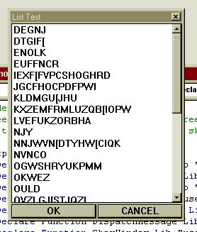



## API ListBox

### Description

This is an all API list-box function. Use it the same way you would use inputbox() or msgbox(). Fully configurable and auto-resizes the controls on the fly. Very easy to use, and a great example to learn API/hooking in Visual Basic.   Vote if you like, but please leave comments if you like or dis-like this code.
 
### More Info
 

             |
---                |---
**Submitted On**   |2001-05-01 15:49:48
**By**             |[Dave Andrews](https://github.com/Planet-Source-Code/PSCIndex/blob/master/ByAuthor/dave-andrews.md)
**Level**          |Advanced
**User Rating**    |4.7 (28 globes from 6 users)
**Compatibility**  |VB 5\.0, VB 6\.0
**Category**       |[VB function enhancement](https://github.com/Planet-Source-Code/PSCIndex/blob/master/ByCategory/vb-function-enhancement__1-25.md)
**World**          |[Visual Basic](https://github.com/Planet-Source-Code/PSCIndex/blob/master/ByWorld/visual-basic.md)
**Archive File**   |[API ListBo19084512001\.zip](https://github.com/Planet-Source-Code/dave-andrews-api-listbox__1-22850/archive/master.zip)

